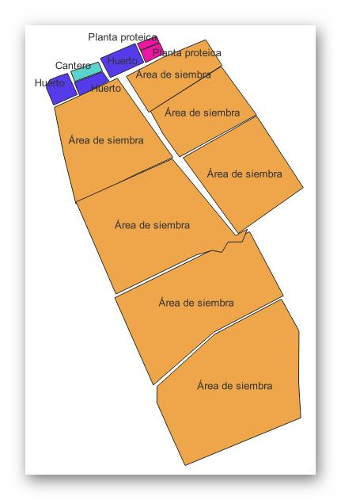
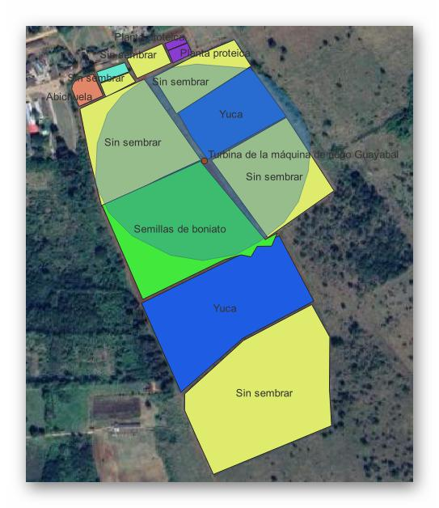

# GeoDataImporter

GeoDataImporter es un conjunto de servicios api-rest desarrollados utilizando la librería Spring-Boot cuyo objetivo es la importación de información contenida en ficheros espaciales. Contiene varios servicios capaces de procesar ficheros de tipo <em>SHP</em>, <em>OBB</em> y <em>KML</em>. Esta información procesada se introducirá de forma automática en una base de datos <em>PostgreSQL</em>, la cual contará previamente con una base de datos y esta a su vez con la extensión <em>Postgis</em>.

Este sistema a su vez también permite incorporar los datos del clima en una localización definida por el usuario. Posteriormente esta información puede ser visualizada utilizando algún sistema GIS de preferencia (por ejemplo QGIS).

## Compilar la aplicación

````shell
mvn clean package install
````

## Configurar servicios

Para configurar los diferentes servicios que componen este sistema se debe acceder al fichero `application.properties` y modificar los siguientes elementos:

- `db_user`: usuario de la base de datos.
- `db_password`: contraseña de la base de datos.
- `db_name`: nombre de la base de datos.
- `file.upload-dir`: ruta temporal donde se copiarán los ficheros antes de ser procesados (esta ruta varía siempre en dependencia del sistema operativo). Debe finalizar un <em>/</em> o <em>\\</em>. En dependencia del sistema operativo.

Podrán ser modificados otros aspectos referentes a los ficheros de subida y el puerto del servidor.

## Ejecutar la aplicación

```shell
mvn spring-boot:run
```

## Probar los servicios

Para probar los servicios se ha creado una colección de <em>Postman</em> que cuenta con una descripción detallada de los servicios a utilizar, así como ejemplos del usos de los mismos. Esta colección podrá encontrarla en el siguiente [fichero](docs/GeoService.postman_collection.json)

## Ejemplos de visualización en QGIS

Tras la realización de la conexión con la base de datos de <em>PostgreSQL</em> en <em>QGIS</em> se pueden visualizar algunos ejemplos de las capas que son importadas con <em>GeoDataImporter</em>. A continuación se muestran algunos ejemplos






